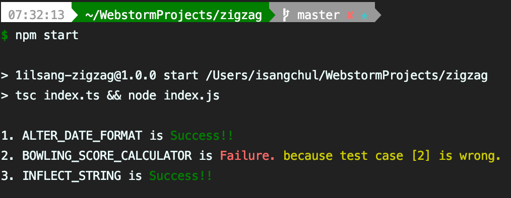
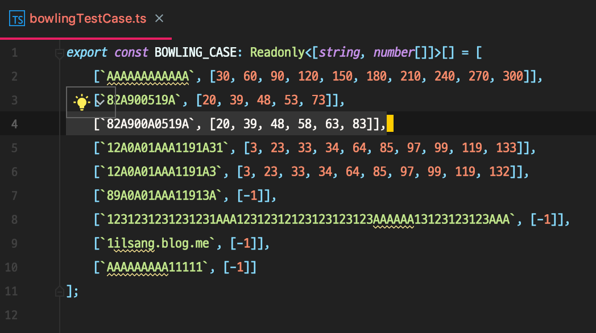

Javascript algorithm practice
---
This is composed of Typescript.

You need `Node.js`, `NPM(or yarn)`

Introduction
---

  There are three problems in the `index.ts`

  1. Alter date format
  2. Bowling score calculator
  3. Inflect string
  
Quick start
---

  ```bash
  $ npm install
  $ npm start
  ```
  
Tests
---

  To run the more test suite, first **modify** the `...TestCase.ts`, then run `npm start `:
  ```bash
  $ npm start
  ```
  
  After that, you can get like this.
  
  
  
  
  
LICENSE
---
This is released under the MIT license. See [LICENSE](LICENSE) for details.
